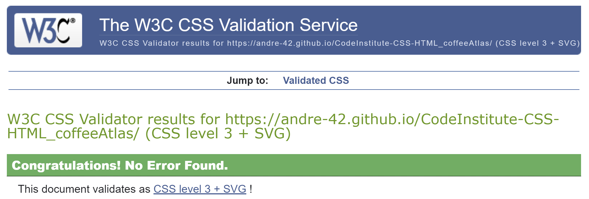

## Coffee Atlas html/css

Visit the deployed site: [Plant Atlas](https://andre-42.github.io/CodeInstitute-CSS-HTML_coffeeAtlas/)

## Contents

* [General Intent](#general-intent)
    * [Concept](#concept)
    * [Usage](#usage)
* [Design](#design)
    * [Color Scheme](#color-scheme)
    * [Typography](#typography)
    * [Imagery](#imagery)
    * [HTML And CSS Features](#features)
    * [Accessibility](#accessibility)
* [Deployment And Local Development](#deployment--local-development)
    * [Deployment](#deployment)
    * [Local Development](#local-development)
* [Testing](#testing)
    *[HTML Validator](#html-validator)
    *[Jigsaw](#css-validator)
    *[Lighthouse](#accessibility-1)
    *[Solved Bugs](#solved-bugs)
    *[Known Bugs](#known-bugs)

## General Intent
The Coffee Atlas is a web platform designed to introduce students and interested people to the world of plant biology and chemistry, with a focus on coffee cultivation. This page has been created as a learning resource for students, as well as for anyone with an interest in understanding the intricate processes that go into growing coffee.

### Concept
- **Interactive Learning:** The Coffee Atlas offers an engaging learning experience. It prompts users with a thought-provoking question, "How long does it take to make a cup of coffee?" to spark curiosity and set the stage for exploration.

- **Informative Content:** The platform provides concise and accessible information about the biology and chemistry of coffee plants. Users can delve into topics like sugar transport, cell wall processing, and protein features related to coffee growth and disease response during development.

- **Visual Presentation:** I use visual aids, images, video and well-structured content to enhance the learning experience. The website is designed with clarity and user-friendliness in mind.

- **Accessibility:** Coffee Atlas is accessible to all users, ensuring that knowledge about plant biology and chemistry is within reach for everyone. To this end topics are only presented in simple terms without diving to deep into the science.

- **Future Intent:** This website is intended to give researchers and others who would be interested in creating a much more comprahensible repository for image based plant science a chance to reach out to myself and my colleagues at the IPK through links in the footer.

### Usage

1. Visit the [Coffee Atlas website](https://andre-42.github.io/CodeInstitute-CSS-HTML_coffeeAtlas/).
2. Explore the introductory question and the topics related to coffee growth.
3. Engage with the content and enrich your understanding of plant biology and chemistry.
4. Contact us (me or the IPK) through the links provided to get involved.

## Design

### Color Scheme

As this website is about the coffee plant, I wanted to stick to green colors to keep the color scheme relevant.

In my css file I used the following colors to represent that theme:

* I have used '#ecfdcc' as a backgound color & '#2C3A0E' as a contrasting primary color used in the main body text.
* The header uses the fallback color '#0c950c' but uses a background image in its standard implementation.
* The footer uses the same background image. However uses a darker background color '#014901' as fallback. This is the same background color as for the navigation bar to frame the main section.
* Buttons, hovered divs and dropdown segments of the menubar are colored '#016401' to present a slight contrast.
* The current button/menu segment of the navbar that represents the html that is currently visited is highlighted in '#9ACD32'.
* The alternative text color used on dark backgrounds is '#f5f5f5'.

### Typography

Google Fonts was used for the primary font Quicksand. Backup fonts are Verdana and Times New Roman. The entire text is held in Quicksand.

### Imagery

Content images come from my research data on coffee imaging which was produced at the IPK (https://www.ipk-gatersleben.de/). This data was presented at the XIV Symposium of Plant Biotechnology by me:
* A. Guendel, S. Wagner, Ortleb, S. Kalms, L., H. Rolletschek and L. Borisjuk; Investigation of early seed development in Coffea arabica using nuclear magnetic resonance (MRI) and infrared imaging. XIV Symposium on Plant Biotechnology, Cayo Santa Maria, Cuba, 2022

### Features

The website is comprised of a home page and a secondary page with content regarding the coffee seed in context of plant diseases.

All pages are responsive and have:

* A favicon in the browser tab.
* The main title in the header and a responsive navigation bar under the header or on left the side of the page.
* The footer acts as a contact section with links to external sites to get in touch with me or the IPK. The footer can be reach by clicking the contact button at the navbar.
* The lower right corner of the page holds a link icon which takes you back to the top of the page.
* The curser changes in response to hovering above links, buttons and selection items. 
* The navbar has dropdown functionality for hovering on desktop screens (see style.css file). Hover functions are switched off (see style.css file) for touchscreen users and JS was implemented to imitate dropdown functionality on touch devices.

#### The Home Page

#### The Aborted Seed Page

#### Future Implementations

### Accessibility

I have been mindful to improve accessibility after first deployment and project submission to my study accessment.

This has been achieved by:
* Using semantic HTML e.g., header, main, section, footer, etc.
* Using hover functionality on interactive content and employing alternative means for touchscreen usage
* Choosing a simple font style for better readability
* Using contrasting colors as best as possible between background and text within the given color scheme.

Accessibility has been tested with Lighthouse in google developer tools, refere to [test section](#testing).

## Deployment & Local Development

### Deployment

The site is deployed using GitHub Pages - [Plant Atlas](https://github.com/Andre-42/CodeInstitute-CSS-HTML_coffeeAtlas/).

To Deploy the site using GitHub Pages:

1. Login (or signup) to Github.
2. Go to the repository for this project, [Andre-42/CodeInstitute-CSS-HTML_coffeeAtlas](https://github.com/Andre-42/CodeInstitute-CSS-HTML_coffeeAtlas/).
3. Click the settings button.
4. Select pages in the left hand navigation menu.
5. From the source dropdown select main branch and press save.
6. The site has now been deployed, please note that this process may take a few minutes before the site goes live.

### Local Development

#### How to Fork

To fork the repository:

1. Log in (or sign up) to Github.
2. Go to the repository for this project, [Andre-42/CodeInstitute-CSS-HTML_coffeeAtlas](https://github.com/Andre-42/CodeInstitute-CSS-HTML_coffeeAtlas/)
3. Click the Fork button in the top right corner.

#### How to Clone

To clone the repository:

1. Log in (or sign up) to GitHub.
2. Go to the repository for this project, [Andre-42/CodeInstitute-CSS-HTML_coffeeAtlas](https://github.com/Andre-42/CodeInstitute-CSS-HTML_coffeeAtlas/)
3. Click on the code button, select whether you would like to clone with HTTPS, SSH or GitHub CLI and copy the link shown.
4. Open the terminal in your code editor and change the current working directory to the location you want to use for the cloned directory.
5. Type 'git clone' into the terminal and then paste the link you copied in step 3. Press enter.

- - -

## Testing

### HTML validator

The HTML content was validated by nu validator (https://validator.w3.org/#validate_by_uri).

### CSS validator

The CSS was validated by Jigsaw validator (https://jigsaw.w3.org/css-validator/) without any issues.

### Accessibility

Accessibility was tested using Lighthouse within the chrome developer tools.

### Solved Bugs

| No | Bug | How I solved the issue |
| :--- | :--- | :--- |
| 1 | Alignment issues were observed at multiple stages to convert the desktop version into more mobile appropriate sizing. In particular gaps between header and navbar were an issue when the aspect ratio of the header changes. This is due to the fact that both are absolutly positioned and fixed so that they stay in place while scrolling. | I identified breakpoints for screen widths where such alignmentent issues occured and implemented css rule changes regarding display options, margins and padding. In case of the header and navbar issue it was a simple fix of adjusting the 'top:' property appropriotly.  |
| 2 | When width references were stated in 100vw. I had boundary issues creating a horizontal scroll bar.| After reading a few posts online about the issue, i realized that this issue comes from margins and their relationship with parental boundaries. I could fix that by using % width declarations. |
| 3 | When jumping to specific sections on the web page via links. The top of those sections were hidden behind the header and navbar. | I knew it was due to the fixed position of header. This makes the top of the section align with the top of the browser after using the link. While browsing this question I read about the use of pseudo-classes for this problem and implemented a solution using ::before. |
| 4 | Fixed position items moved when scrolling while checking the page in developer tools with android phone settings. | Stackoverflow helped again. I found the same issue there and the fix was to add content="minimum-scale=1" to <meta> in the head of the HTML. |
| 6 | Trouble with active statement and hover in touchscreen mode. While my dropdown menu in the navbar was expanding when pressing the not hidden link. It only appeared while pressing the link. When I lost touch with my finger it collapsed again. | I tried implementing different ways using :active and :focus pseudo classes and it partially worked. However this lead to a point that the dropdown part did not hide again when focus should have been on a different section of the page. In the end I resorted to using JS functions for this purpose to create a collapsable dropdown menu for touch applications. |

### Known Bugs

* There is still a minor alignment issue when viewing the websites 2nd page in horizontal mode on my phone (iPhone SE2). Idealy the video and image in the first section should either be in one line (horizontal) or below each other and as wide as the text column (vertical mode). Its response is correct when checked in the chrome developer tools but when I view it on my phone I see a misalignment issue.

* Load time seems to be an issue with larger images and the video file. This could be immproved in future iterations by further customizing image sizes and resolution and connecting videos via external links and store them on sites like youtube. 

 
