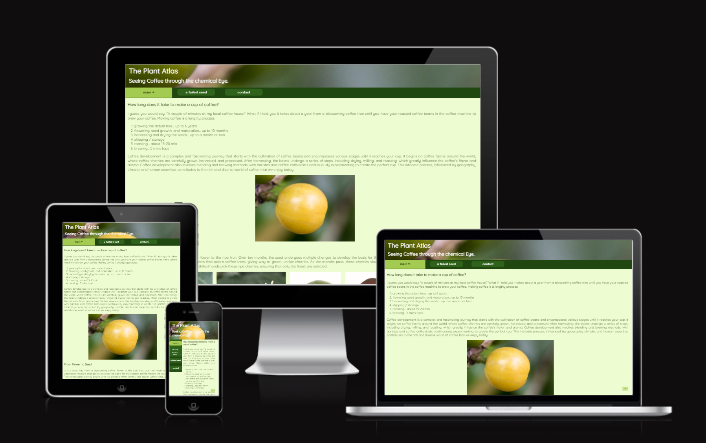
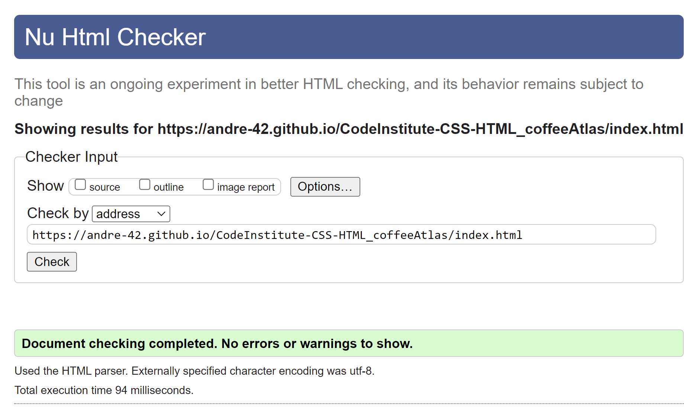
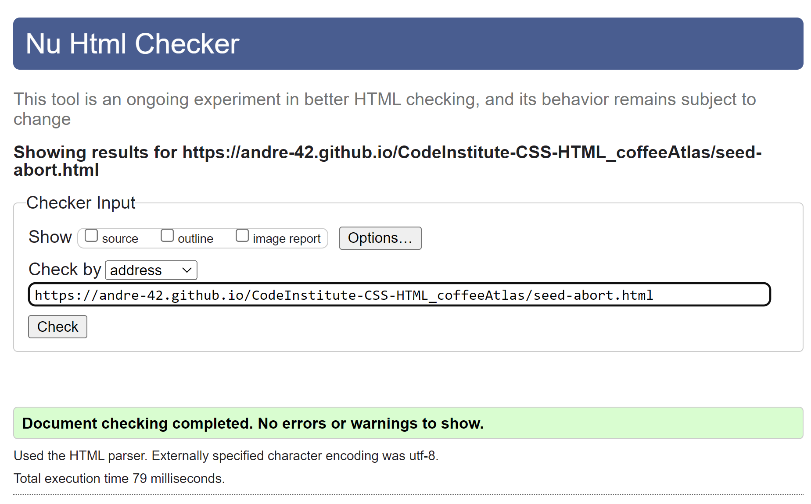
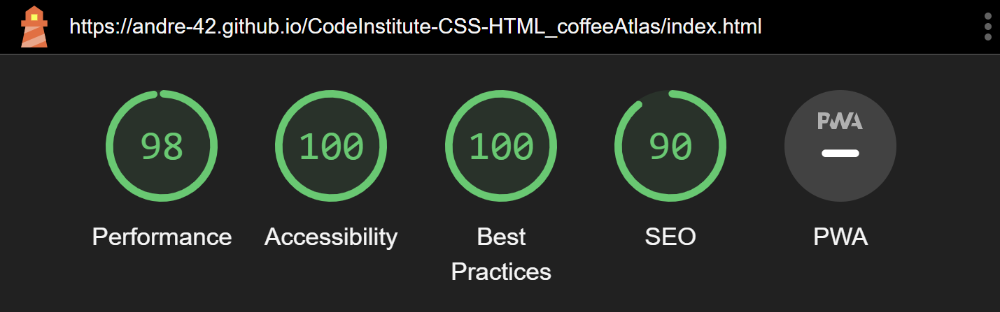
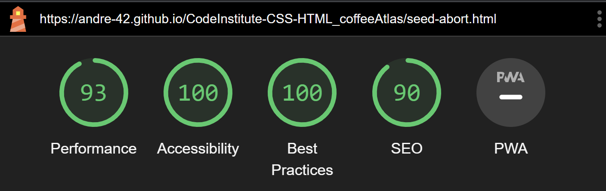
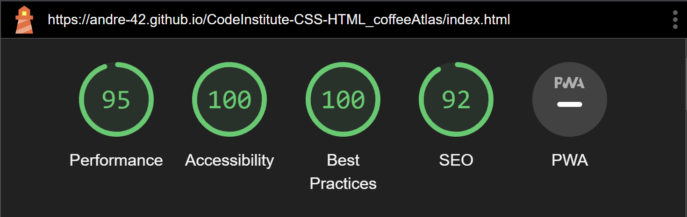
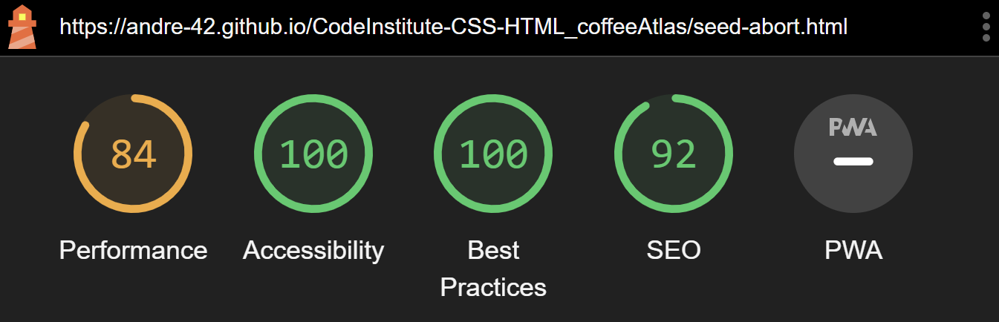

# Plant Atlas -  Testing

Visit the deployed site: [Plant Atlas](https://andre-42.github.io/CodeInstitute-CSS-HTML_coffeeAtlas/)

- - -

## CONTENTS

* [AUTOMATED TESTING](#automated-testing)
  * [W3C Validator](#w3c-validator)
  * [JavaScript Validator](#javascript-validator)
  * [Lighthouse](#lighthouse)
* [MANUAL TESTING](#manual-testing)
  * [Testing User Stories](#testing-user-stories)
  * [Full Testing](#full-testing)

Testing was ongoing throughout the entire build. I utilised Chrome developer tools whilst building to pinpoint and troubleshoot any issues as I went along.

During development I made use of google developer tools to ensure everything was working correctly and to assist with troubleshooting when things were not working as expected.

I have gone through each page using google chrome developer tools.

## AUTOMATED TESTING

### W3C Validator

[W3C](https://validator.w3.org/) was used to validate the HTML on all pages of the website. It was also used to validate the CSS.

* [index.html](index.html)
 - Passed.

* [seed-abort.html](seed-abort.html)
 - Passed.

* [style.css](assets/css/style.css)
[style.css](documentation/css-validator.png) - Passed, no errors found.

- - -

### Lighthouse

I used Lighthouse within the Chrome Developer Tools to test the performance, accessibility, best practices and SEO of the website.

### Desktop Results

Each page is achieving a score of 100 for accessibility and best practise. All other parameters score 90 or above.

### Mobile Results

Each page is achieving a score of 100 for accessibility and best practise. Only the performance for the seed-abort.html scored below 90.

- - -

## MANUAL TESTING

### Testing User Stories

`First Time Visitors`

| Goals | How are they achieved? |
| :--- | :--- |
| I want users to consider the work that goes into coffee production and learn something new about coffee development| The page allows the user to brows through different informational snippets about coffee growth and effects of diseases on the growing plant. |
| I want the site to be responsive to my device. | I have developed the site with responsiveness in mind. Both navigational elements and the context adjusts in response to the viewing device. |
| I want the site to be easy to navigate and interactive for the user. | Buttons and linked icons are used throughout the site for navigation. The content can be found via the navigation menu as well as through internal links. The user is able to select content to be viewed and play video content to have alternatives to reading. |

`Returning And Frequent Visitors`

| Goals | How are they achieved? |
| :--- | :--- |
| I want the user to be able to find more information than the content of the website. | Users are able to select external links to find out more about coffee diseases. External links open in a new tab. |
| I want professional users to be able to reach out to me and the institute that was invloved in creating the data. | Users of the site are able to follow links to my linkedIN, reseachgate and github profile to contact me. Additionally users are able to follow a link to the rearch groups home page that was involved in the research. |

- - -

### Full Testing

Full testing was performed on the following devices:

* Laptop:
  * ASUS Vivobook Pro 16x OLED
* Mobile Devices:
  * iPhone SE 2.

Each device tested the site using the following browsers:

* Google Chrome
* Safari

`Home Page`

| Feature | Expected Outcome | Testing Performed | Result | Pass/Fail |
| --- | --- | --- | --- | --- |
| The Sites title | Title changes dimensions responsive to viewing device and not constrict other sections of the html. | Checked different devices in developer tools on chrome. | Header does not obscure other content | Pass |
| Menu | Changes from top bar to side bar | Checked responsiveness to screen sizes in developer tools. | Navbar changed from horizontal orientation to side orientation with smaller screen sizes | Pass |
| Content display | Responsiveness | Changing screen size. | Main content loads and organizes according to screen layout. No overlaps or unintended gaps were observed. | Pass |
| Main button | Hover extents submenu | Checked hovering with mouse. | Navbar extended while hovering and closed when leaving the section | Pass |
| Main button | No hover on touch screen devices but button push function. | Checked collapsibility of submenu on touch screen. | When pushing main, sub menu extends and retract after second push on main. | Pass |
| Just a cup link | Functionality | Checked that hovering underscores the link and pressing will move the main section to the appropriate chapter | Link works as expected. Section heading shows below the header after click. | Pass |
| Flower to bean link | Functionality | Checked that hovering underscores the link and pressing will move the main section to the appropriate chapter | Link works as expected. Section heading shows below the header after click. | Pass |
| A failed seed link | Functionality | Checked that hovering creates a visual response of the link and pressing will open the abort-seed.html | Link works as expected. Page changes upon click. | Pass |
| Contact link | Functionality | Checked hovering and execution function. | Link works as expected. Hovering creates a visual response and clicking will move the viewpoint to the footer section. | Pass |
| All links in main and footer section | Functionality | Hover over link and clicking on links. | Links works as expected. Internal links direct user to expected content on the page. External links open new tab with external content. All links give visual response to hovering. | Pass |

`Seed Abort Page`

| Feature | Expected Outcome | Testing Performed | Result | Pass/Fail |
| --- | --- | --- | --- | --- |
| The Sites title | Title changes dimensions responsive to viewing device and not constrict other sections of the html. | Checked different devices in developer tools on chrome. | Header does not obscure other content | Pass |
| Menu | Changes from top bar to side bar | Checked responsiveness to screen sizes in developer tools. | Navbar changed from horizontal orientation to side orientation with smaller screen sizes | Pass |
| Content display | Responsiveness | Changing screen size. | Main content loads and organizes according to screen layout. No overlaps or unintended gaps were observed. | Pass |
| Main button | Functionality | Checked that hovering creates a visual response of the link and pressing will open the abort-seed.html | Link works as expected. Page changes upon click. | Pass |
| A failed seed button | Hover extents submenu | Checked hovering with mouse. | Navbar extended while hovering and closed when leaving the section | Pass |
| A failed seed button | No hover on touch screen devices but button push function. | Checked collapsibility of submenu on touch screen. | When pushing main, sub menu extends and retract after second push on main. Icons change according to submenu state. | Pass |
| The cherry link | Functionality | Checked that hovering underscores the link and pressing will move the main section to the appropriate chapter | Link works as expected. Section heading shows below the header after click. | Pass |
| Its challenges link | Functionality | Checked that hovering underscores the link and pressing will move the main section to the appropriate chapter | Link works as expected. Section heading shows below the header after click. | Pass |
| Starvation link | Functionality | Checked that hovering underscores the link and pressing will move the main section to the appropriate chapter | Link works as expected. Section heading shows below the header after click. | Pass |
| The nutritional highway link | Functionality | Checked that hovering underscores the link and pressing will move the main section to the appropriate chapter | Link works as expected. Section heading shows below the header after click. | Pass |
| Contact link | Functionality | Checked hovering and execution function. | Link works as expected. Hovering creates a visual response and clicking will move the viewpoint to the footer section. | Pass |
| All links in main and footer section | Functionality | Hover over link and clicking on links. | Links works as expected. Internal links direct user to expected content on the page. External links open new tab with external content. All links give visual response to hovering. | Pass |
| Video | video function | Idle at load, play / pause function | When loading the page the video is idle. After clicking play, it will start and when clicking pause it will stop. | Pass |
| Feature selection menu | Selectable image display | Checked if every item in the selection box can be selected. | Default image changes after selecting a different image in the selection box. Correct image is loaded in accordance with selected item. Function works both on mobile and desktop devices |